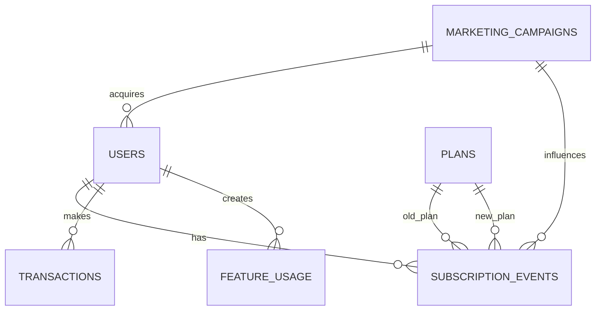

# fintech-subscription-churn-analytics

An end-to-end PostgreSQL portfolio project for **NovaPay**, a fictional European fintech subscription product. It answers:

> What behaviours are associated with paid subscription churn or downgrade, and which customer segments generate sustainable subscription value?

This project demonstrates relational modelling, repeatable data loading, data-quality validation, analytical SQL, point-in-time subscription state, product metrics, and business interpretation. It intentionally contains no machine-learning model or application layer.

> **Synthetic-data disclaimer:** NovaPay, every record, and every price, FX rate, discount, revenue rate, and cost assumption are fictional. Nothing here is Revolut data or a claim about Revolut's products or economics.

## Architecture

```text
Python standard-library generator -> CSV files (gitignored) -> PostgreSQL core tables
                                                        -> analytics views
                                                        -> analysis SQL
```



The `core` schema contains six constrained relational tables. The `analytics` schema contains four readable views for journeys, subscription intervals, paid lifecycles, and synthetic charges. Final questions live in separate files under `analysis/`.

## Repository structure

```text
data/generate_data.py          fixed-seed standard-library generator
sql/00_create_schemas.sql      repeatable schema reset
sql/01_create_tables.sql       tables, keys, and constraints
sql/02_load_data.sql           CSV load and table statistics
sql/03_quality_checks.sql      16 checks; raises on any invalid row
sql/04_analytics_views.sql     reusable analytical views and monthly churn metric
sql/05_indexes.sql             three query-driven indexes
analysis/                      seven business analyses
tests/test_expected_results.sql  fixed-seed and analytical-invariant tests
docs/data_model.md
docs/metric_definitions.md
docs/performance.md
docs/learning_guide.md
```

Generated CSV files, the database volume, local credentials, caches, and virtual environments are excluded by `.gitignore`.

## Run locally

Requirements: Docker with Compose and Python 3. No Python packages are needed. The default host port is `54329`.

```bash
cp .env.example .env
python3 data/generate_data.py
docker compose up -d --wait
```

Build, validate, and index the database from an empty or existing volume:

```bash
set -e
for file in \
  sql/00_create_schemas.sql \
  sql/01_create_tables.sql \
  sql/02_load_data.sql \
  sql/03_quality_checks.sql \
  sql/04_analytics_views.sql \
  sql/05_indexes.sql
do
  docker compose exec -T postgres psql -U novapay -d novapay -f - < "$file"
done
```

Run every analysis and the expected-result tests:

```bash
set -e
for file in analysis/*.sql tests/test_expected_results.sql
do
  docker compose exec -T postgres psql -U novapay -d novapay -f - < "$file"
done
```

To reset the database volume first, run `docker compose down -v`, then repeat the commands. Stop without deleting data with `docker compose down`.

## Data generated

Seed: `20270101`. Analysis cutoff: `2025-12-31 23:59:59`.

| Table | Rows |
|---|---:|
| `users` | 15,000 |
| `plans` | 5 |
| `marketing_campaigns` | 6 |
| `subscription_events` | 37,483 |
| `transactions` | 191,271 |
| `feature_usage` | 77,792 |

The journeys follow signup → verification → deposit → first successful transaction → optional paid subscription. Subscription events reconstruct valid plan histories. The generator probabilistically plants higher churn with declining activity, lower benefit engagement, larger discounts, and payment problems. See [the data model](docs/data_model.md).

Original-currency amounts are converted before aggregation. Fixed synthetic rates are stored on every transaction, and `amount_eur = round(amount_original * fx_rate_to_eur, 2)`. This deliberately omits rate history, spreads, and fees.

## Metrics and actual results

Definitions and economics coefficients are in [metric_definitions.md](docs/metric_definitions.md). Key observed results from the fixed-seed run:

| Result | Measured value |
|---|---:|
| Signup → verification | 92.44% |
| Verification → deposit | 89.63% |
| Deposit → first successful transaction | 96.19% |
| Successful transaction → paid | 36.13% |
| Signup → paid overall | 28.79% (4,319 users) |
| Paid users churned by cutoff | 3,280 |
| Involuntary churners | 687 (20.95% of churn) |
| Weighted six-month retention for mature paid users | 49.63% (1,865 / 3,758) |
| Total net subscription revenue | €327,983.00 |
| December 2025 MAU / active paid | 7,938 / 1,039 |
| December 2025 transaction success rate | 95.11% |

Paid churn is cancellations divided by paid subscribers active at the start of the month; inactive free users are excluded. Retention always uses the full original paid cohort as denominator and reports only mature cohort ages. Pre-churn features use the 90 days strictly before churn, or before the equivalent cutoff for retained customers.

## Business observations

These are expected patterns in deliberately constructed synthetic data, not causal or real-company findings.

1. The main funnel loss is paid conversion: 11,955 users made a valid first successful transaction, but 4,319 became paid (36.13%).
2. Paid-social acquisition converted 31.40% of signups to paid versus 27.01% for organic acquisition. This does not establish incremental campaign impact.
3. In the comparable pre-cutoff window, churned users averaged 4.09 transactions and €663.49 successful volume versus 5.77 and €1,119.03 for retained users. Churned users were also less recent (12.93 versus 9.73 days since activity).
4. Churned users averaged 0.80 failed transactions in the prior 90 days versus 0.23 for retained users; 20.95% of all churn was labelled payment-failure driven.
5. Large-discount campaigns converted strongly but retained less well: Premium Trial (70% discount) had 41.34% paid conversion and 65.51% three-month retention, while Everyday Banking (20%) had 32.31% and 76.97% respectively.
6. Under the stated synthetic cost model, total contribution was highest for Premium (€39.69k), followed by Metal (€37.70k), Elite (€35.85k), Plus (€15.46k), and Basic transaction activity (€61.14k). Higher list prices did not automatically produce the highest paid-plan contribution because benefit costs rose too.

## Quality checks and tests

`sql/03_quality_checks.sql` reports and then fails on duplicates, orphans, missing required values, invalid amounts/currencies/FX, events before signup, invalid plan transitions, cancellations without paid state, contradictory histories, and impossible campaign timing. All **16 checks returned zero invalid rows**.

`tests/test_expected_results.sql` executes nine fixed-seed checks plus four analytical-invariant tests covering funnel chronology, cohort retention, and the at-risk churn population. All **13 tests passed**. Database constraints provide an additional first line of validation.

## Performance

For 3,000 point-in-time subscription lookups, the measured plan changed from repeated sequential scans to an index-only scan after adding `(user_id, event_timestamp DESC)`. Execution fell from **3,210.437 ms** to **2.685 ms**, with shared-buffer activity falling from **1,224,934** hits to **9,873 hits + 68 reads**. The roughly 1,196× ratio is specific to this deliberately repeated lookup and local run, not a general performance promise. The query and actual plan excerpts are recorded in [performance.md](docs/performance.md).

## Limitations

- The generator encodes the relationships later observed, so results validate SQL behaviour rather than discover market truth.
- One FX rate per currency, exact campaign attribution, simplified monthly billing, and no taxes, refunds, chargebacks, or partial periods are substantial simplifications.
- A user can have one paid lifecycle and cannot re-subscribe after cancellation.
- Pre-churn comparisons are observational and are not causal estimates.
- Contribution excludes many real costs and should not be read as actual fintech economics.
- Data ends at the cutoff; immature campaign and retention periods are excluded rather than guessed.

## Technologies

PostgreSQL 16, Docker Compose, SQL, and Python 3 standard library. The [learning guide](docs/learning_guide.md) walks through the model, joins, funnel CTEs, windows, denominators, currency conversion, index, and practice exercises.
